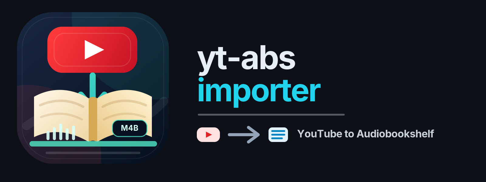

# yt-abs-importer

<p align="center">
  
</p>

A self-hosted sidecar application that converts individual YouTube videos into `.m4b` audiobook files and writes them directly to the directory that [Audiobookshelf](https://www.audiobookshelf.org/) scans.

> **This is not an Audiobookshelf plugin.** It is an independent container that shares the same podcast/audiobook directory as your Audiobookshelf instance.

---

## Table of Contents

1. [Overview](#overview)
2. [UI Description](#ui-description)
3. [Features](#features)
4. [Requirements](#requirements)
5. [Proxmox Deployment (Recommended)](#proxmox-deployment-recommended)
6. [NFS Share Setup](#nfs-share-setup)
7. [Docker Compose Setup](#docker-compose-setup)
8. [Configuration Reference](#configuration-reference)
9. [How to Use](#how-to-use)
10. [Audiobookshelf Setup](#audiobookshelf-setup)
11. [Retry Failed Jobs](#retry-failed-jobs)
12. [Verify Output with ffprobe](#verify-output-with-ffprobe)
13. [Security Notes](#security-notes)
14. [Development](#development)
15. [Troubleshooting](#troubleshooting)

---

## Overview

Workflow:

1. Paste a YouTube video URL into the web UI.
2. The app fetches metadata (title, channel, duration, chapters) using `yt-dlp`.
3. Select the destination folder inside your Audiobookshelf podcasts directory.
4. Optionally edit the output title.
5. Submit — a background worker downloads the audio with `yt-dlp` and remuxes it to `.m4b` with `ffmpeg`.
6. The finished `.m4b` is written to your Audiobookshelf media directory.
7. Optionally trigger an Audiobookshelf library scan via API.

---

## UI Description

### Home Page (`/`)
- YouTube URL input field
- "Preview" button

### Preview Page (`/preview`)
- Video thumbnail, title, channel name, handle (`uploader_id`), channel ID
- Duration, upload date, detected chapter count
- **Destination folder** dropdown (populated from `OUTPUT_ROOT`)
- **New folder** input to create a new author/podcast directory
- **Editable output title** (defaults to video title)
- Checkboxes: embed metadata, embed thumbnail, embed chapters, trigger ABS scan
- "Create M4B" submit button

### Jobs Page (`/jobs`)
- Table of recent jobs: title, destination, status, timestamps
- Status badges: `queued`, `running`, `downloading`, `converting`, `verifying`, `succeeded`, `failed`, `cancelled`

### Job Detail Page (`/jobs/{id}`)
- Full status, phase, attempt count, duration, chapter count
- Source URL, destination folder, final output path
- Process log (live-refreshing while job is active)
- **Retry** button for failed/cancelled jobs
- **Cancel** button for active jobs

---

## Features

- ✅ Single-video-only by default (rejects playlist/channel URLs)
- ✅ Metadata preview before downloading
- ✅ Background download via RQ worker
- ✅ `yt-dlp` with embedded metadata, thumbnail, chapters
- ✅ `ffmpeg` remux to `.m4b` with cover art; falls back to audio-only if needed
- ✅ ffprobe output verification
- ✅ Per-job log files
- ✅ Filename collision handling (skip/overwrite/append_id/append_counter)
- ✅ Path traversal prevention
- ✅ Audiobookshelf library scan API integration (optional)
- ✅ Retry failed jobs (UI + API)
- ✅ Optional HTTP Basic Auth
- ✅ `DRY_RUN` mode for testing
- ✅ PUID/PGID support for NFS volume permissions
- ✅ YAML + environment variable configuration

---

## Requirements

- Docker + Docker Compose v2
- Network access to YouTube
- A NFS (or local) directory shared with Audiobookshelf

---

## Proxmox Deployment (Recommended)

You can install `yt-abs-importer` on Proxmox VE either using our automated VM installer script or via manual LXC bind-mounts.

### 1. Automated VM Installer (Recommended)

Our installer provisions a Debian 12 virtual machine on your Proxmox host running either in **Docker VM** or **Native VM** mode.

> [!WARNING]
> **Security Check:** Always inspect scripts before running them as `root` on your Proxmox host.
> You can inspect the installer script at [scripts/proxmox/proxmox-install.sh](scripts/proxmox/proxmox-install.sh).

SSH to your Proxmox host as `root` and run the interactive installer:

```bash
bash -c "$(curl -fsSL https://raw.githubusercontent.com/andrewtryder/yt-abs-importer/main/scripts/proxmox/proxmox-install.sh)"
```

For complete instructions on configuration, mounts, logs, updates, and troubleshooting, read the [Proxmox Installer Documentation](scripts/proxmox/README.md).

### 2. Manual LXC Container Setup

The manual pattern for Proxmox is to mount the NFS share at the **LXC/VM host level** and bind-mount it into the container.

#### A. Mount NFS on the host

```bash
# On Proxmox host — add to /etc/fstab
nas.local:/volume1/podcasts  /mnt/podcasts  nfs  defaults,_netdev,nofail  0  0

# Or mount manually
mount -t nfs nas.local:/volume1/podcasts /mnt/podcasts
```

#### B. In your LXC container, bind-mount the host path

In Proxmox UI: Container → Resources → Add Mount Point:
- Host path: `/mnt/podcasts`
- Mount point: `/mnt/podcasts`

Or via `pct.conf`:
```
mp0: /mnt/podcasts,mp=/mnt/podcasts
```

#### C. Run Docker Compose inside the LXC

In `docker-compose.yml`, the volume becomes:
```yaml
volumes:
  - /mnt/podcasts:/media/podcasts
```

---

## NFS Share Setup

Make sure your NFS share:

- Is mounted at the same path that Audiobookshelf uses as its Podcasts library root
- Has write permissions for the `PUID`/`PGID` you configure (default 1000:1000)

```bash
# Verify mount and permissions
ls -la /mnt/podcasts
# Should show your existing podcast folders
```

---

## Docker Compose Setup

### 1. Clone and configure

```bash
git clone https://github.com/andrewtryder/yt-abs-importer.git
cd yt-abs-importer

cp .env.example .env
# Edit .env with your settings
```

### 2. Create local directories

```bash
mkdir -p data config
```

### 3. Edit `docker-compose.yml`

Update the podcast volume to match your NFS mount:
```yaml
volumes:
  - /mnt/podcasts:/media/podcasts  # ← your actual path
```

### 4. Start

```bash
docker compose up --build -d
```

The app will be available at `http://localhost:8080` (or the host IP on your LAN).

### 5. View logs

```bash
docker compose logs -f app
docker compose logs -f worker
```

---

## Configuration Reference

All options can be set as environment variables or in `/config/config.yaml`.
**Environment variables take precedence over YAML values.**

| Variable | Default | Description |
|---|---|---|
| `APP_HOST` | `0.0.0.0` | Bind address |
| `APP_PORT` | `8080` | Bind port |
| `APP_BASE_URL` | — | Public URL (optional) |
| `APP_SECRET_KEY` | `changeme-...` | Required if auth enabled |
| `AUTH_ENABLED` | `false` | Enable HTTP Basic Auth |
| `AUTH_USERNAME` | — | Basic auth username |
| `AUTH_PASSWORD` | — | Basic auth password |
| `REDIS_URL` | `redis://redis:6379/0` | Redis connection URL |
| `DATABASE_URL` | `sqlite+aiosqlite:////data/app.db` | SQLite path |
| `WORK_DIR` | `/data/work` | Temporary download directory |
| `ARCHIVE_FILE` | `/data/config/youtube-archive.txt` | yt-dlp archive file |
| `OUTPUT_ROOT` | `/media/podcasts` | Root of Audiobookshelf podcasts dir |
| `ALLOW_PLAYLISTS` | `false` | Allow playlist URLs |
| `ALLOW_CHANNELS` | `false` | Allow channel URLs |
| `DEFAULT_DESTINATION_FOLDER` | — | Pre-selected folder |
| `YTDLP_BIN` | `yt-dlp` | Path to yt-dlp binary |
| `FFMPEG_BIN` | `ffmpeg` | Path to ffmpeg |
| `FFPROBE_BIN` | `ffprobe` | Path to ffprobe |
| `YTDLP_AUDIO_FORMAT` | `m4a` | yt-dlp audio format |
| `YTDLP_AUDIO_QUALITY` | — | yt-dlp audio quality |
| `YTDLP_EXTRA_ARGS` | — | Extra yt-dlp args (space-separated) |
| `FFMPEG_EXTRA_ARGS` | — | Extra ffmpeg args |
| `OUTPUT_EXTENSION` | `m4b` | Output file extension |
| `FILENAME_TEMPLATE` | `{title}.m4b` | Filename template |
| `FOLDER_NAME_FIELD` | `uploader_id` | Primary folder naming field |
| `FOLDER_NAME_FALLBACKS` | `uploader_id,channel_id,...` | Fallback chain |
| `COLLISION_MODE` | `append_id` | File collision: `skip`/`overwrite`/`append_id`/`append_counter` |
| `MAX_CONCURRENT_JOBS` | `1` | Max simultaneous downloads |
| `JOB_TIMEOUT_SECONDS` | `10800` | Per-job timeout (3 hours) |
| `RETRY_MAX` | `3` | Maximum retry attempts |
| `RETRY_INTERVAL_SECONDS` | `60,300,900` | Retry wait intervals |
| `CLEANUP_TEMP_ON_SUCCESS` | `true` | Delete work dir on success |
| `CLEANUP_TEMP_ON_FAILURE` | `false` | Delete work dir on failure |
| `ABS_BASE_URL` | — | Audiobookshelf base URL |
| `ABS_API_TOKEN` | — | Audiobookshelf API token |
| `ABS_LIBRARY_ID` | — | Audiobookshelf library ID |
| `ABS_SCAN_AFTER_SUCCESS` | `false` | Trigger ABS scan after each job |
| `DRY_RUN` | `false` | Build commands only, don't download |

### Example `config/config.yaml`

```yaml
app:
  host: "0.0.0.0"
  port: 8080
  auth_enabled: false

paths:
  work_dir: "/data/work"
  archive_file: "/data/config/youtube-archive.txt"
  output_root: "/media/podcasts"

download:
  allow_playlists: false
  allow_channels: false
  audio_format: "m4a"
  filename_template: "{title}.m4b"
  folder_name_field: "uploader_id"

jobs:
  max_concurrent_jobs: 1
  timeout_seconds: 10800
  retry_max: 3
  retry_intervals_seconds: [60, 300, 900]

audiobookshelf:
  base_url: "http://audiobookshelf:13378"
  api_token: "your-token"
  library_id: "your-library-id"
  scan_after_success: true
```

---

## How to Use

1. Open `http://<your-server>:8080`
2. Paste a YouTube video URL (e.g. `https://www.youtube.com/watch?v=CcYToxtmFHs`)
3. Click **Preview** — the app fetches metadata
4. On the preview page:
   - Select a destination folder from the dropdown, or type a new folder name
   - Edit the output title if needed
   - Check/uncheck embed options
5. Click **Create M4B**
6. You'll be redirected to the Job Detail page
7. The log updates automatically while the job runs
8. When complete, the `.m4b` file path is shown

---

## Audiobookshelf Setup

1. In Audiobookshelf, add a Podcasts library pointing to `/media/podcasts` (or your equivalent)
2. Each subfolder becomes a "podcast" that ABS scans
3. Place `.m4b` files inside those subfolders

To auto-scan after each import:
- Set `ABS_BASE_URL`, `ABS_API_TOKEN`, `ABS_LIBRARY_ID` in your environment
- Set `ABS_SCAN_AFTER_SUCCESS=true`
- You can get your library ID from the ABS admin UI under Libraries

---

## Retry Failed Jobs

**Via UI:**
1. Go to `/jobs`
2. Click the failed job
3. Click **Retry Job**

**Via API:**
```bash
curl -X POST http://localhost:8080/api/jobs/{job_id}/retry
```

**Archive bypass:** If a video was already downloaded (in `youtube-archive.txt`) and you want to re-download, temporarily set `ALLOW_ARCHIVE_BYPASS=true` or manually remove the video ID from the archive file:

```bash
grep -v "youtube CcYToxtmFHs" data/config/youtube-archive.txt > /tmp/archive.tmp
mv /tmp/archive.tmp data/config/youtube-archive.txt
```

---

## Verify Output with ffprobe

```bash
# Basic check
ffprobe -v quiet -print_format json -show_streams -show_chapters \
  "/mnt/podcasts/MyChannel/My Episode.m4b" | jq .

# Check for audio stream
ffprobe -v error -select_streams a:0 -show_entries stream=codec_name,duration \
  -of default=noprint_wrappers=1 "/mnt/podcasts/MyChannel/My Episode.m4b"

# List chapters
ffprobe -v error -show_chapters "/mnt/podcasts/MyChannel/My Episode.m4b"
```

---

## Security Notes

- **Default Binding:** For safety, the default Docker Compose configuration binds only to localhost (`127.0.0.1:8080`). To expose the application to your LAN, change this in `docker-compose.yml` to `"8080:8080"`, but make sure to enable HTTP Basic Authentication first.
- **Authentication:** Do not expose the application directly to the public internet without enabling Basic Auth. Set `AUTH_ENABLED=true`, `AUTH_USERNAME=admin`, and `AUTH_PASSWORD=yoursecurepassword` in your environment, and configure a strong `APP_SECRET_KEY`.
- **Reverse Proxy:** We strongly recommend routing public traffic through a trusted reverse proxy (such as Nginx, Caddy, or Cloudflare Tunnels) configured with SSL/TLS.
- Only YouTube domains are allowed by default (configurable via `ALLOWED_DOMAINS`).
- Playlist and channel URLs are rejected by default.
- All subprocess calls use argument arrays — never `shell=True`.
- All paths are validated against the `OUTPUT_ROOT` — path traversal is rejected.
- API tokens are never logged or displayed in the UI.

---

## Development

### Setup

```bash
python -m venv .venv
source .venv/bin/activate
pip install -r requirements-dev.txt
```

### Run locally

```bash
# Start Redis (needs Docker or local Redis)
docker run -d -p 6379:6379 redis:7-alpine

# Set environment
export REDIS_URL=redis://localhost:6379/0
export DATABASE_URL=sqlite+aiosqlite:///./app.db
export OUTPUT_ROOT=/tmp/test-podcasts
export WORK_DIR=/tmp/ytabs-work
export DRY_RUN=true

# Start app
uvicorn app.main:app --reload --port 8080

# Start worker (in another terminal)
rq worker ytabs --url redis://localhost:6379/0
```

### Tests

```bash
pytest
```

### Lint

```bash
ruff check .
ruff format --check .
```

---

## Troubleshooting

### yt-dlp extractor errors

```
ERROR: [youtube] CcYToxtmFHs: Video unavailable
```
The video is private, age-restricted, or region-blocked. Nothing the app can do.

```
ERROR: Unable to extract uploader id
```
Update yt-dlp: `docker compose pull` then `docker compose up --build`.

---

### ffmpeg "Tag text incompatible" error

```
Tag text incompatible with output codec id 'mp4a'...
```

This happens when the `.m4a` contains an incompatible data stream. The app **automatically retries** with an audio-only fallback command (no video/cover stream). If you still see this, check the job log for the fallback command output.

---

### Permission denied on NFS

Symptom: Worker writes fail with `Permission denied` on `/media/podcasts/...`

Fix:
1. Find the UID of your NFS share owner: `ls -lan /mnt/podcasts`
2. Set `PUID` and `PGID` in `docker-compose.yml` to match:
   ```yaml
   environment:
     - PUID=1001
     - PGID=1001
   ```
3. Restart: `docker compose up -d`

---

### Files not appearing in Audiobookshelf

1. Trigger a manual scan: ABS → Library → Scan
2. Or set `ABS_SCAN_AFTER_SUCCESS=true` with ABS API credentials
3. Check that the `.m4b` is inside a subfolder of the library root (ABS expects `LibraryRoot/AuthorOrShow/Episode.m4b`)

---

### Archive file causing skipped downloads

If `youtube-archive.txt` contains the video ID, yt-dlp will skip it:

```
[download] CcYToxtmFHs has already been recorded in the archive
```

Remove it manually:
```bash
grep -v "CcYToxtmFHs" data/config/youtube-archive.txt > /tmp/fix.txt
mv /tmp/fix.txt data/config/youtube-archive.txt
```

Then retry the job.

---

### Missing chapters

YouTube chapters come from the video description (timestamp list). If the video has no timestamp list in the description, no chapters are embedded. This is normal.

---

### Missing thumbnail / cover art

If ffmpeg fails to embed the thumbnail, the app falls back to audio-only (no cover art). The job still succeeds. Check the job log for:

```
[ffmpeg] Primary command failed: ...
[ffmpeg] Retrying without cover art stream...
```

You can manually embed a thumbnail with:
```bash
ffmpeg -i "My Episode.m4b" -i cover.jpg -map 0:a -map 1 \
  -c copy -disposition:v:0 attached_pic "My Episode-final.m4b"
```
