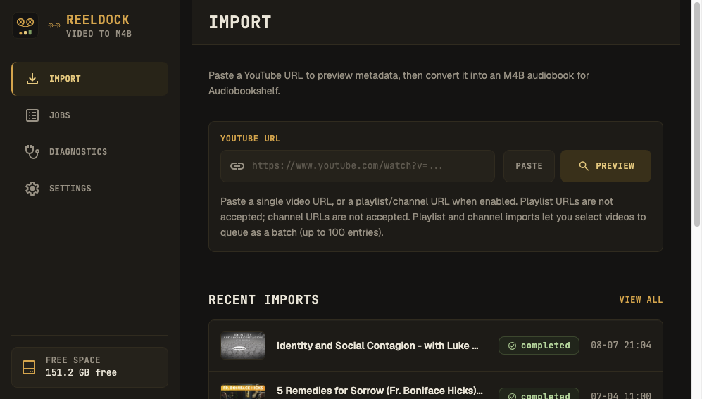
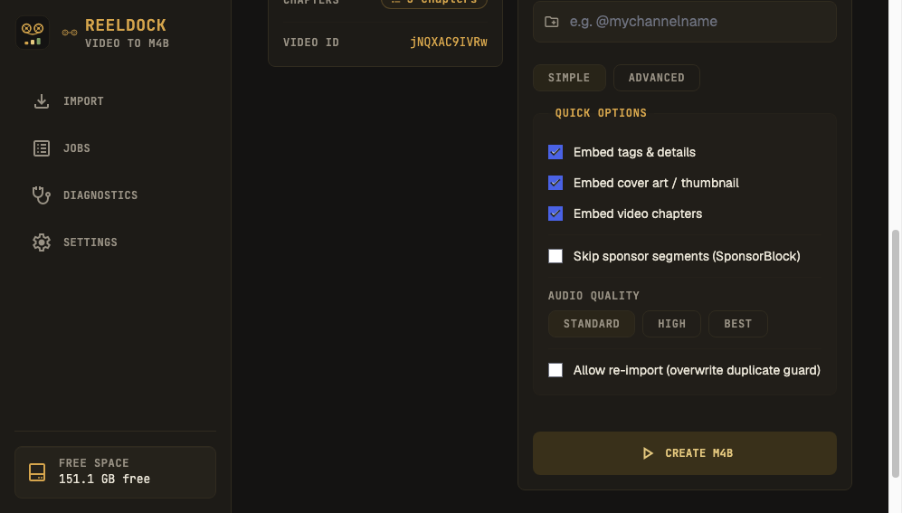
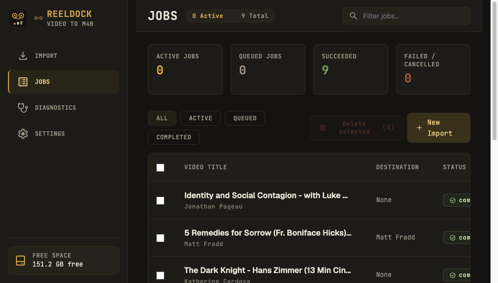

# reeldock

<p align="center">
  
</p>

<p align="center">
  <a href="https://scorecard.dev/viewer/?uri=github.com/andrewtryder/reeldock"></a>
</p>

A self-hosted sidecar that turns YouTube videos (and selected playlist/channel batches) into `.m4b` audiobooks and writes them into the directory [Audiobookshelf](https://www.audiobookshelf.org/) scans.

> [!NOTE]
> **This is not an Audiobookshelf plugin.** It is an independent container that shares the same podcast/audiobook directory as your Audiobookshelf instance.
>
> ReelDock is not affiliated with YouTube, Google, or Audiobookshelf. Use it only with content you have the right to download and keep.

---

## Quick Start (Docker Compose)

```bash
git clone https://github.com/andrewtryder/reeldock.git
cd reeldock
cp .env.example .env
# Edit HOST_PODCASTS_DIR (and AUTH_* if you will expose beyond localhost)
mkdir -p data config
docker compose up -d --build
```

Open **http://localhost:8080** (bound to localhost by default).

Images are also published to Docker Hub / GHCR after CI on `main`. See the [Quickstart Guide](docs/quickstart.md).

<p align="center">
  
</p>
<p align="center">
  
</p>
<p align="center">
  
</p>

---

## What It Does

1. Paste a YouTube video, playlist, or channel URL (playlists/channels require Settings flags).
2. Preview metadata; for batches, select which videos to queue.
3. Choose destination folder, Simple/Advanced import options (embed, SponsorBlock, audio quality, loudness, …).
4. Background workers download with `yt-dlp`, remux with `ffmpeg`, and write `.m4b` files atomically.
5. Optionally trigger an Audiobookshelf library scan via API.

---

## Features

- **Single-video and batch import** — playlist/channel enumeration with per-video selection (`MAX_PLAYLIST_ENTRIES`).
- **Simple / Advanced import panel** — embed options, SponsorBlock skip-segments, audio quality presets, loudness normalization, per-job overrides.
- **Browser extension** — queue the current YouTube tab into your local instance (token required when the extension API is enabled).
- **Background jobs** — RQ worker with live progress and job logs.
- **Audiobookshelf integration** — shared media root + optional post-success library scan.
- **Diagnostics** — authenticated path/permission checks (public `/ready` stays minimal for probes).
- **Security defaults** — localhost bind, optional HTTP Basic Auth via `.env`, URL allowlisting, path traversal guards.
- **Reproducible images** — locked Python deps (`uv.lock`), pinned base/uv/yt-dlp digests in the Dockerfile.

---

## Path Model Summary

* **`HOST_PODCASTS_DIR`**: Directory on the Docker host (Audiobookshelf media).
* **`CONTAINER_PODCASTS_DIR`**: Mount inside the container (usually `/media/podcasts`).
* **`OUTPUT_ROOT`**: Where the app writes; must match `CONTAINER_PODCASTS_DIR` in Docker.

> [!IMPORTANT]
> In Docker, Settings should normally keep `OUTPUT_ROOT=/media/podcasts` — the container path, not the host path.

See [Paths and Volumes](docs/paths-and-volumes.md) for Mac/Linux examples.

---

## Responsible use

ReelDock shells out to `yt-dlp` / `ffmpeg` for personal media workflows. Respect YouTube’s terms and copyright law. Do not use this project to redistribute content you do not own or have license to keep.

---

## Upgrade / rename notes

If you are migrating from older names or images:

- Update remotes to `github.com/andrewtryder/reeldock`.
- Prefer current image/service names (`reeldock`).
- Reinstall the Firefox extension if the extension ID changed.
- Extension auth headers use `X-REELDOCK-Token` / `REELDOCK_*` naming.
- Existing SQLite databases are stamped onto Alembic on first boot of builds that include migrations.

---

## Detailed Documentation

* 📖 [Quickstart](docs/quickstart.md)
* 📁 [Paths and Volumes](docs/paths-and-volumes.md)
* ⚙️ [Configuration](docs/configuration.md)
* 🐋 [Docker Deployment](docs/deployment-docker.md)
* 🖥️ [Proxmox VE](docs/deployment-proxmox.md)
* 📚 [Audiobookshelf](docs/audiobookshelf.md)
* 🧩 [Browser extension](browser-extension/README.md)
* 🛠️ [Troubleshooting](docs/troubleshooting.md)
* 🔒 [Security](docs/security.md)
* 💻 [Development](docs/development.md)
* 🚀 [Releasing](docs/releasing.md)

---

## Development

```bash
uv sync --dev
uv sync --locked --dev
uv run --frozen ruff format --check .
uv run --frozen ruff check .
uv run --frozen mypy app worker
uv run --frozen pytest
```

See the [Development Guide](docs/development.md).
